import { FileTree } from '@astrojs/starlight/components';

> End-to-end architecture of the Guidewire Insurance Suite — xCenter internals, inter-system flows (PC → BC → CC), Contact Manager, and external integration patterns.

---

## 1. The Guidewire Insurance Suite — Big Picture

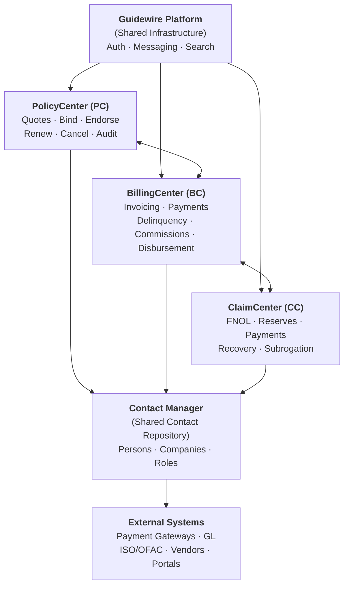

**One-line summary per xCenter:**
- **PC** — What is insured, for how much, under what terms
- **BC** — Collect the premium for it
- **CC** — Pay the loss when something goes wrong, recover what you can
- **Contact Manager** — Who everyone is (shared across all xCenters)

---

## 2. Contact Manager — The Shared Foundation

Contact Manager (CM) is the **central contact repository** across the entire suite. Every person or organization referenced in PC, BC, or CC is ultimately a Contact in CM.

### What CM Stores

| Entity | Examples |
|---|---|
| **Person** | Named insured, claimant, adjuster, producer |
| **Company** | Insurance carrier, vendor, repair shop, law firm |
| **Roles** | PolicyHolder, Producer, Vendor, Claimant, LienHolder |

### CM Integration Points

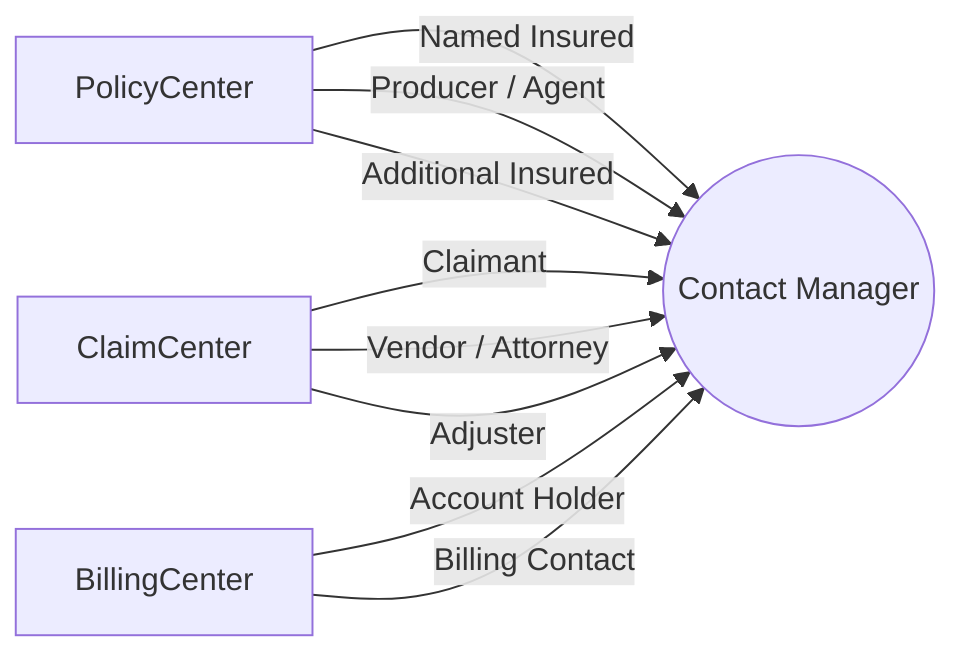

### Key CM Principles

- **Single source of truth** — update a contact once, reflected across all xCenters
- **Role-based** — same Person can be a PolicyHolder in PC and a Claimant in CC
- **Address/Phone/Email** — centrally managed, not duplicated per xCenter
- **Duplicate detection** — CM merges duplicate contacts to avoid data sprawl

```gosu
// Business Purpose: Look up or create a contact in Contact Manager before assigning to policy
// Edge Case: Same person may already exist with slightly different name spelling
var contact = gw.api.database.Query.make(Person)
    .compare("TaxID", Relop.Equals, taxId)
    .select().FirstResult

if (contact == null) {
  contact = new Person(bundle)
  contact.FirstName = firstName
  contact.LastName  = lastName
  contact.TaxID     = taxId
}
```

---

## 3. PolicyCenter Architecture

### Core Responsibility
Policy lifecycle management — submission to issuance, renewal, endorsement, cancellation, and audit.

### Internal Architecture

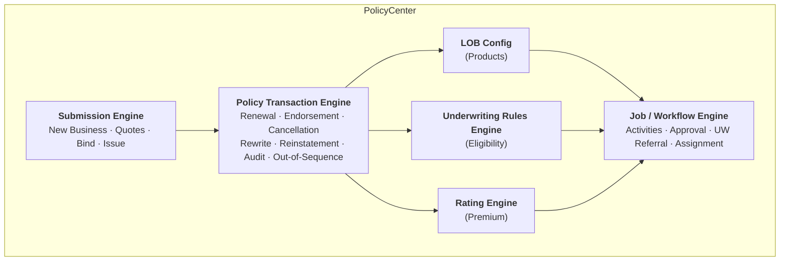

### PC Key Domains

| Domain | Purpose |
|---|---|
| **Product Model** | Defines LOBs, coverages, conditions, exclusions |
| **Submission Engine** | Quote → Bind → Issue lifecycle |
| **Policy Transactions** | Endorsements, cancellations, rewrites, audits |
| **Underwriting Rules** | Eligibility, referral, approval gates |
| **Rating Engine** | Premium calculation per coverage |
| **Job Framework** | All transactions modeled as Jobs (auditable) |
| **Account** | Insured entity, holds policies |
| **Producer / Agency** | Distribution channel, commission tracking |

### PC Policy Lifecycle Flow

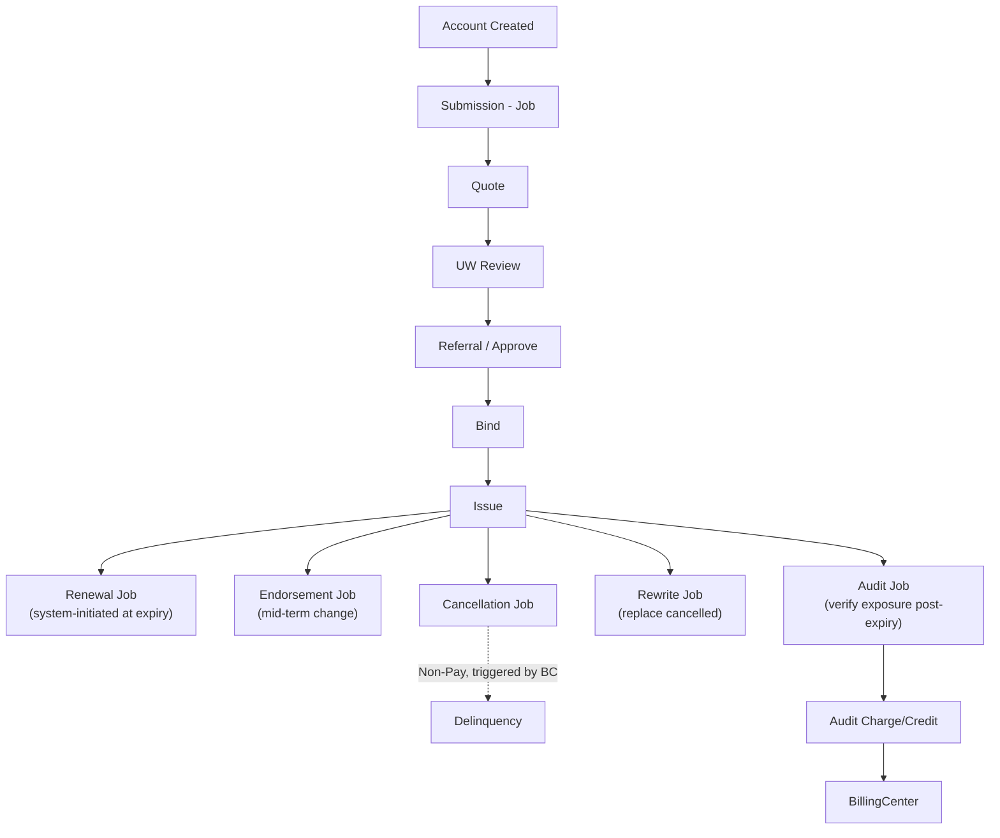

---

## 4. BillingCenter Architecture

### Core Responsibility
Premium collection — invoicing, payments, delinquency, commissions, and disbursements.

### Internal Architecture

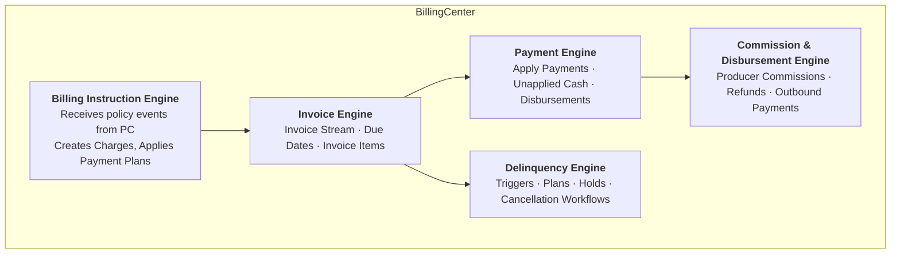

### BC Domain Model (Data Hierarchy)

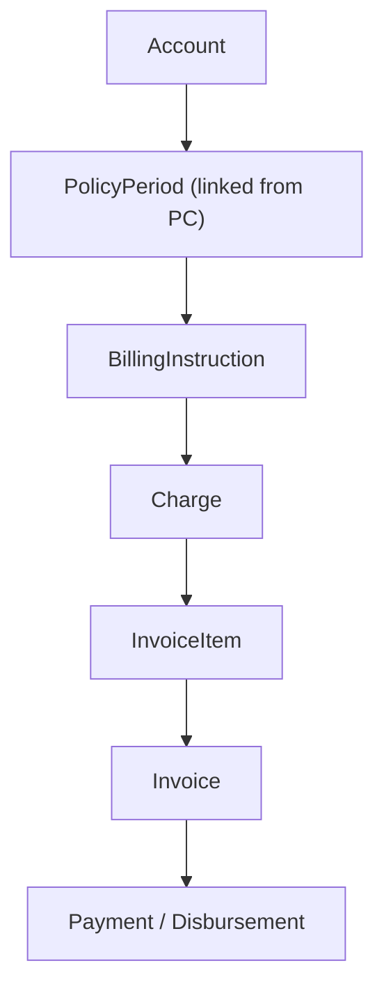

### BC Core Subsystems

| Subsystem | Purpose |
|---|---|
| **Invoice Engine** | Generates invoices from billing instructions |
| **Payment Engine** | Applies payments, handles unapplied cash |
| **Delinquency Engine** | Triggers and manages delinquency workflows |
| **Commission Engine** | Calculates and tracks producer commissions |
| **Disbursement Engine** | Handles refunds and outbound payments |

### BC Configuration Points

<FileTree>
- configuration/
  - config/
    - BillingRules.xml billing rule sets
    - PaymentAllocationRules how payments are applied
    - DelinquencyRules triggers, plans, actions
  - gsrc/
    - gw/
      - plugin/ plugin implementations
      - bc/ custom Gosu logic
  - resources/
    - typelists/ custom typelist extensions
</FileTree>

---

## 5. ClaimCenter Architecture

### Core Responsibility
End-to-end claim lifecycle — FNOL through closure, reserves, payments, and recoveries.

### Internal Architecture

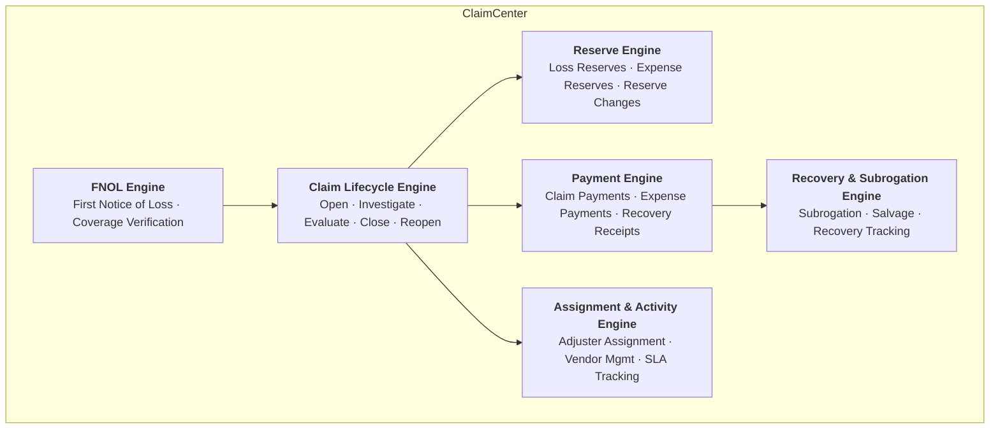

### CC Key Domains

| Domain | Purpose |
|---|---|
| **FNOL** | Intake, policy lookup, coverage match |
| **Claim** | Master claim record, loss date, cause |
| **Exposure** | Coverage-specific unit of claim handling |
| **Reserve** | Financial estimate per exposure (loss + expense) |
| **Transaction** | Payments, recoveries, reserve changes |
| **Check** | Payment instrument generated from transactions |
| **Subrogation** | Recovery from responsible 3rd parties |
| **Vendor** | External service providers (repair shops, doctors) |
| **Activity** | Tasks assigned to adjusters, vendors, specialists |

### CC Claim Lifecycle Flow

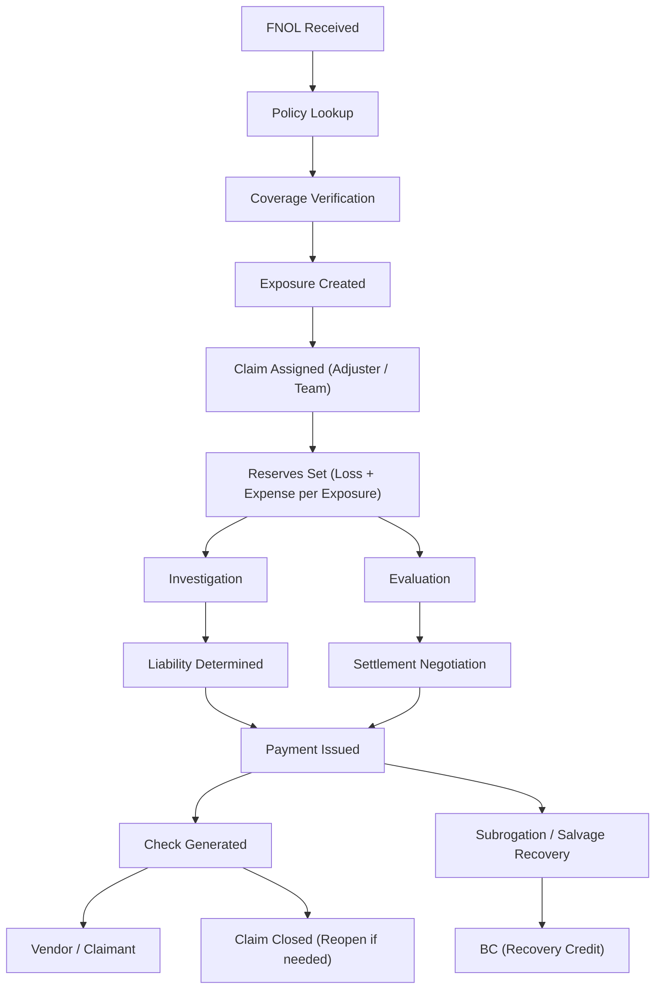

---

## 6. End-to-End Integration Flows

### PC → BC: Policy Lifecycle Events

```
PC Event               BC Action
────────               ─────────
Policy Issued    ──►  Create Account + PolicyPeriod
                       Apply Payment Plan
                       Generate Invoice Stream

Endorsement      ──►  Charge / Return Premium
                       Adjust Scheduled Items

Renewal          ──►  New Term Charges + New Invoice Stream

Cancellation     ──►  Flat / Pro-rata Return Premium
                       Stop Future Invoices

Audit Finalized  ──►  Audit Charge or Credit
                       Settle Invoice Stream

Reinstatement    ──►  Restore charges + past due amount
```

**Plugin hook — BC receives BillingInstruction from PC:**

```gosu
// Business Purpose: Custom validation when billing instruction arrives from PC
// Edge Case: Mid-term endorsements create amendment charges, not new instructions
class BillingInstructionPlugin implements IBillingInstructionPlugin {

  override function beforeCreateBillingInstruction(
      instruction : BillingInstruction) : void {

    var account = instruction.PolicyPeriod.Account
    if (account.TotalOutstandingDue > THRESHOLD) {
      throw new BillingException("Account has unresolved balance — cannot bind")
    }
  }
}
```

### BC → PC: Delinquency-Triggered Cancellation

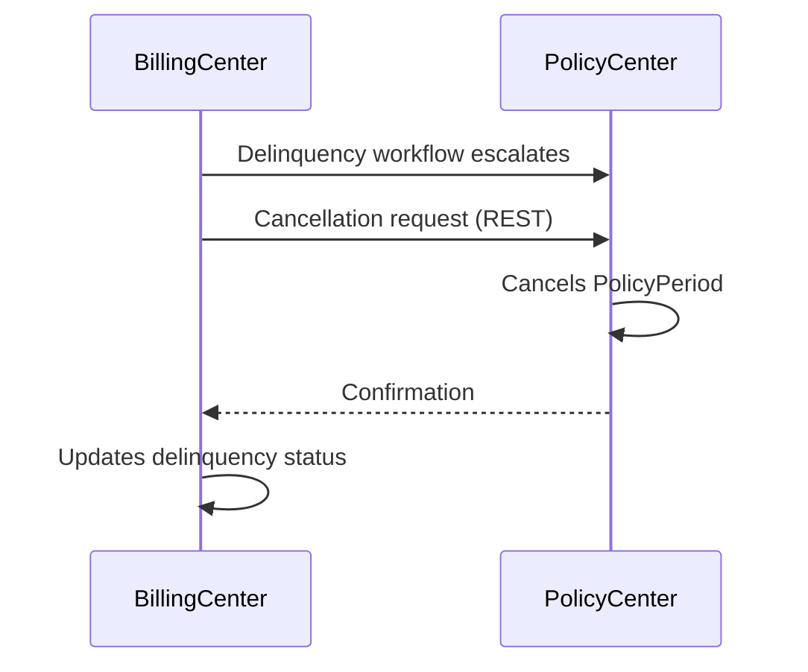

### PC → CC: Policy Data for Claims

```
PC Data Available in CC at FNOL
────────────────────────────────
- Policy coverages at time of loss
- Coverage limits / deductibles
- Named insureds / additional insureds
- Producers / agents
- Policy period (effective / expiration)
- LOB-specific exposure data
```

### CC → BC: Recovery Credits

```
CC Event               BC Action
────────               ─────────
Recovery Received ──►  Credit transaction on policy account
Salvage Received  ──►  Credit applied to claim cost offset
```

### Deductible Collection (CC → BC)

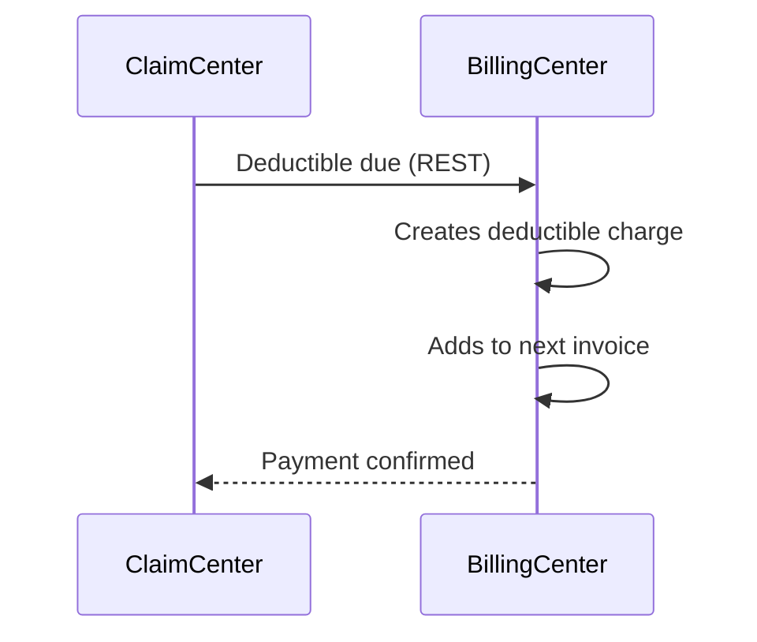

---

## 7. External System Integration Patterns

### Integration Architecture Overview

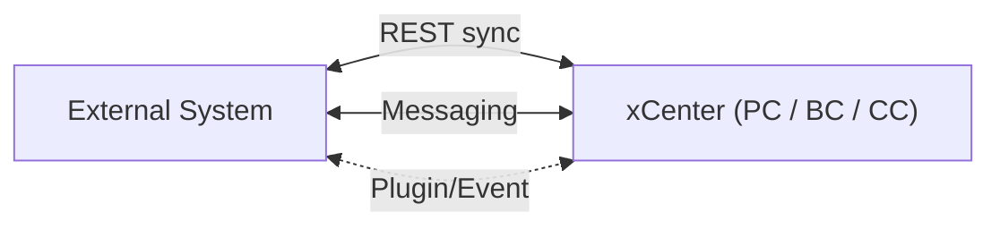

| Pattern | When to Use | Example |
|---|---|---|
| **Synchronous REST** | Real-time, response needed immediately | Payment gateway auth |
| **Async Messaging** | Fire-and-forget, high volume | Policy bound → BC |
| **Plugin** | Intercept internal behavior | Custom payment allocation |
| **Batch / File** | Legacy systems, bulk data | Premium bordereaux export |

---

### REST Integration (Inbound to BC)

```
External System ──► Integration Gateway ──► BillingCenter API
```

```bash
POST /bc/rest/apis/v1/accounts/{accountId}/payments
Authorization: Bearer <token>
Content-Type: application/json

{
  "amount": 1500.00,
  "currency": "USD",
  "paymentMethod": "CreditCard",
  "referenceNumber": "TXN-20240101-001",
  "effectiveDate": "2024-01-15"
}
```

```gosu
// Business Purpose: Validate inbound payment from payment gateway before recording
// Edge Case: Duplicate reference numbers from gateway retries
class ExternalPaymentPlugin implements IPaymentPlugin {

  override function validatePayment(payment : Payment) : List<String> {
    var errors = new ArrayList<String>()
    var existing = findByReferenceNumber(payment.ReferenceNumber)
    if (existing != null) {
      errors.add("Duplicate payment reference: ${payment.ReferenceNumber}")
    }
    return errors
  }
}
```

---

### Async Messaging (Outbound from BC)

```
BillingCenter ──► Message Queue (JMS) ──► GL System
                                     └──► Notification Service
                                     └──► Data Warehouse
```

| Event | Trigger | Consumer |
|---|---|---|
| `InvoiceDue` | Invoice becomes due | Notification service |
| `PaymentReceived` | Payment applied | ERP / GL system |
| `DelinquencyInitiated` | Delinquency starts | CRM |
| `PolicyCancelled` | BC-initiated cancellation | Data warehouse |

---

### Plugin-Based Integration (Key BC Plugins)

| Plugin Interface | Purpose |
|---|---|
| `IPaymentPlugin` | Intercept payment creation / validation |
| `IBillingInstructionPlugin` | Hook into instruction processing |
| `IDelinquencyPlugin` | Custom delinquency trigger logic |
| `ICommissionPlugin` | Custom commission calculation |
| `IPaymentAllocationPlugin` | Control how payments are applied |
| `IInvoicePlugin` | Hook into invoice generation |

**Plugin registration:**

```xml
<plugin-config>
  <plugin interface="gw.plugin.billing.IPaymentPlugin"
          class="gw.bc.plugin.ExternalPaymentPlugin"/>
  <plugin interface="gw.plugin.billing.IDelinquencyPlugin"
          class="gw.bc.plugin.CustomDelinquencyPlugin"/>
</plugin-config>
```

---

## 8. xCenter Comparison

| Dimension | PolicyCenter | BillingCenter | ClaimCenter |
|---|---|---|---|
| **Core Object** | Policy / Job | Account / Invoice | Claim / Exposure |
| **Transaction Model** | Policy Jobs | Financial Transactions | Reserve / Payment Transactions |
| **Workflow Driver** | UW Rules + Approval | Payment Plans + Delinquency | Adjuster Assignment + SLA |
| **Key Integration Out** | BC (charges), CC (policy data) | GL, Payment Gateway | BC (recovery), Vendors |
| **Key Integration In** | Agent Portals, Rating | PC (policy events) | PC (coverage), Vendors |
| **Financial Impact** | Premium determination | Premium collection | Loss payment |

---

## 9. Cloud vs On-Premise

| Aspect | On-Premise | Guidewire Cloud |
|---|---|---|
| **Deployment** | Customer-managed servers | Guidewire-managed AWS |
| **Integration** | Direct DB / SOAP / JMS | REST via Integration Gateway |
| **Configuration** | Full filesystem access | Studio + App Events |
| **Upgrades** | Manual, infrequent | Continuous delivery |
| **Extension points** | Plugins, Gosu, PCF | App Events, Accelerators, REST |

:::caution[Cloud Constraint]
In Guidewire Cloud, outbound calls **cannot** be made directly from Gosu plugins.
All external calls must go through **Integration Gateway** or **App Events**.
:::

---

## 10. Core Architecture Principles

- **Never bypass GORM** — no raw SQL. All data access through entities.
- **Plugins over core changes** — extend via plugin interfaces only.
- **Bundle discipline** — always control transaction scope. Avoid nested bundles.
- **Upgrade safety** — `gsrc/` and `config/` survive upgrades; core edits do not.
- **OOTB first** — evaluate platform capability before writing custom logic.
- **Contact Manager** — never duplicate contact data across xCenters; always reference CM.

---

## Related

- [Integration Patterns](/architecture/integration-patterns/)
- [Design Decisions](/architecture/design-decisions/)
- [Bundle Handling Patterns](/gosu-patterns/bundle-handling/)
- [Query Patterns](/gosu-patterns/query-patterns/)
